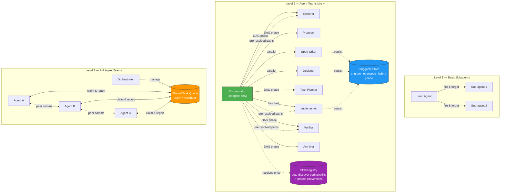

# Architecture

Deep dive into how Agent Teams Lite is structured. For quick start, see the [main README](../README.md).

---

## Where Agent Teams Lite Fits

Agent Teams Lite sits between basic sub-agent patterns and full Agent Teams runtimes:



---

## Capability Comparison

| Capability | Basic Subagents | Agent Teams Lite | Full Agent Teams |
|---|:---:|:---:|:---:|
| Delegate-only lead | — | ✅ | ✅ |
| DAG-based phase orchestration | — | ✅ | ✅ |
| Parallel phases (spec ∥ design) | — | ✅ | ✅ |
| Structured result envelope | — | ✅ | ✅ |
| Pluggable artifact store | — | ✅ | ✅ |
| **Skill auto-discovery** | — | ✅ | ✅ |
| Shared task queue with claim/heartbeat | — | — | ✅ |
| Teammate ↔ teammate communication | — | — | ✅ |
| Dynamic work stealing | — | — | ✅ |

---

## System Architecture

```
┌──────────────────────────────────────────────────────────┐
│  ORCHESTRATOR (coordinator — never does real work)         │
│                                                           │
│  Responsibilities:                                        │
│  • Delegate ALL tasks to sub-agents (not just SDD)        │
│  • Launch sub-agents via Task tool                        │
│  • Show summaries to user                                 │
│  • Ask for approval between phases                        │
│  • Track state: which artifacts exist, what's next        │
│  • Suggest SDD for substantial features/refactors         │
│                                                           │
│  Context usage: MINIMAL (only state + summaries)          │
└──────────────┬───────────────────────────────────────────┘
               │
               │ Task(subagent_type: 'general', prompt: 'Read skill...')
               │
    ┌──────────┴──────────────────────────────────────────┐
    │                                                      │
    ▼          ▼          ▼         ▼         ▼           ▼
┌────────┐┌────────┐┌────────┐┌────────┐┌────────┐┌────────┐
│EXPLORE ││PROPOSE ││  SPEC  ││ DESIGN ││ TASKS  ││ APPLY  │ ...
│        ││        ││        ││        ││        ││        │
│ Fresh  ││ Fresh  ││ Fresh  ││ Fresh  ││ Fresh  ││ Fresh  │
│context ││context ││context ││context ││context ││context │
└───┬────┘└───┬────┘└───┬────┘└───┬────┘└───┬────┘└───┬────┘
    │         │         │         │         │         │
    └─────────┴─────────┴────┬────┴─────────┴─────────┘
                             │
              (receive pre-resolved skill paths
               from the orchestrator's launch prompt)
                             │
                 ┌───────────▼───────────┐      ┌────────────────────┐
                 │    SUB-AGENT USES     │      │   SKILL REGISTRY   │
                 │   skills as directed  │      │                    │
                 │ • React, TDD, etc.   │      │ • Your coding      │
                 │ • Project conventions │      │   skills + paths   │
                 └───────────────────────┘      │ • Project conven- │
                                                │   tions (agents.md)│
                           ORCHESTRATOR ────────▶ resolves once/session
                                                └────────────────────┘
```

---

## The Dependency Graph

```
                    proposal
                   (root node)
                       │
         ┌─────────────┴─────────────┐
         │                           │
         ▼                           ▼
      specs                       design
   (requirements                (technical
    + scenarios)                 approach)
         │                           │
         └─────────────┬─────────────┘
                       │
                       ▼
                    tasks
                (implementation
                  checklist)
                       │
                       ▼
                    apply
                (write code)
                       │
                       ▼
                    verify
               (quality gate)
                       │
                       ▼
                   archive
              (merge specs,
               close change)
```

---

## Sub-Agent Result Contract

Each sub-agent must return a structured envelope with these fields:

| Field | Description |
|-------|-------------|
| `status` | `success`, `partial`, or `blocked` |
| `executive_summary` | 1-3 sentence summary of what was done |
| `detailed_report` | (optional) Full phase output, or omit if already inline |
| `artifacts` | List of artifact keys/paths written |
| `next_recommended` | The next SDD phase to run, or "none" |
| `risks` | Risks discovered, or "None" |

Example:

```markdown
**Status**: success
**Summary**: Proposal created for `{change-name}`. Defined scope, approach, and rollback plan.
**Artifacts**: Engram `sdd/{change-name}/proposal` | `openspec/changes/{change-name}/proposal.md`
**Next**: sdd-spec or sdd-design
**Risks**: None
```

`executive_summary` is intentionally short. `detailed_report` can be as long as needed for complex architecture work.

---

## Project Structure

```
agent-teams-lite/
├── README.md                          ← Project overview and quick start
├── LICENSE
├── skills/                            ← 12 skill files + shared conventions
│   ├── _shared/                       ← Shared conventions (referenced by all skills)
│   │   ├── persistence-contract.md    ← Mode resolution, sub-agent context protocol, skill loading
│   │   ├── engram-convention.md       ← Supplementary: deterministic naming & recovery
│   │   └── openspec-convention.md     ← File paths, directory structure, config reference
│   ├── sdd-init/SKILL.md             ← Bootstraps project + builds skill registry
│   ├── sdd-explore/SKILL.md
│   ├── sdd-propose/SKILL.md
│   ├── sdd-spec/SKILL.md
│   ├── sdd-design/SKILL.md
│   ├── sdd-tasks/SKILL.md
│   ├── sdd-apply/SKILL.md            ← v2.0: TDD workflow support
│   ├── sdd-verify/SKILL.md           ← v2.0: Real test execution + spec compliance matrix
│   ├── sdd-archive/SKILL.md
│   ├── skill-registry/SKILL.md       ← Scans skills + conventions, writes .atl/skill-registry.md
│   ├── issue-creation/SKILL.md       ← GitHub issue creation workflow
│   └── branch-pr/SKILL.md            ← Branch + pull request workflow
├── docs/                              ← Deep-dive documentation
│   ├── architecture.md               ← This file: system design and structure
│   └── token-economics.md            ← Token cost analysis and delegation savings
├── examples/                          ← Config examples per tool
│   ├── claude-code/CLAUDE.md
│   ├── opencode/
│   │   ├── opencode.single.json       ← Ready-to-use config (all agents, default model)
│   │   ├── opencode.multi.json        ← Template config (all agents, customize model per phase)
│   │   ├── commands/sdd-*.md          ← Slash commands for OpenCode
│   │   └── plugins/background-agents.ts ← Async background delegation plugin (both modes)
│   ├── gemini-cli/GEMINI.md
│   ├── codex/agents.md
│   ├── vscode/copilot-instructions.md
│   ├── antigravity/sdd-orchestrator.md
│   └── cursor/.cursorrules
└── scripts/
    ├── setup.sh                       ← Full setup: detect + install + configure (Unix)
    ├── setup.ps1                      ← Full setup: detect + install + configure (Windows)
    ├── install.sh                     ← Skills-only installer (Unix)
    └── install.ps1                    ← Skills-only installer (Windows)

# Generated in target projects (not in this repo):
.atl/
└── skill-registry.md                  ← Auto-generated skill catalog for sub-agents
```
